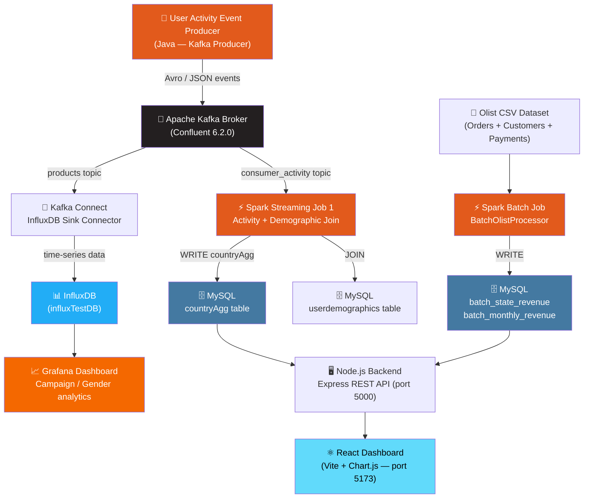
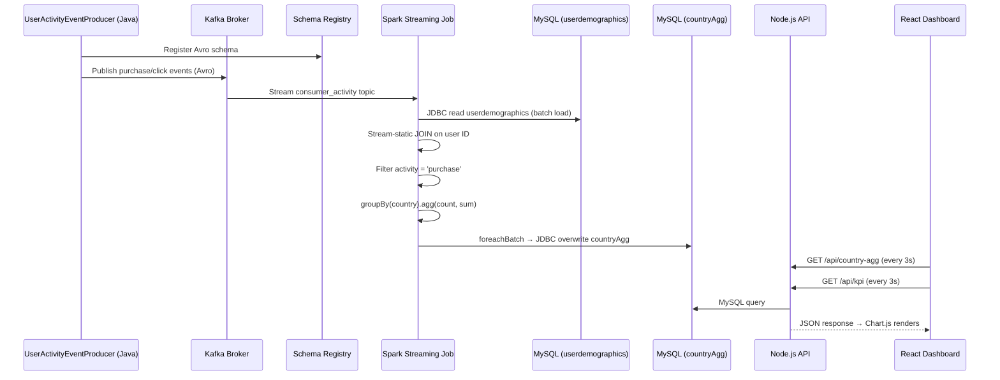
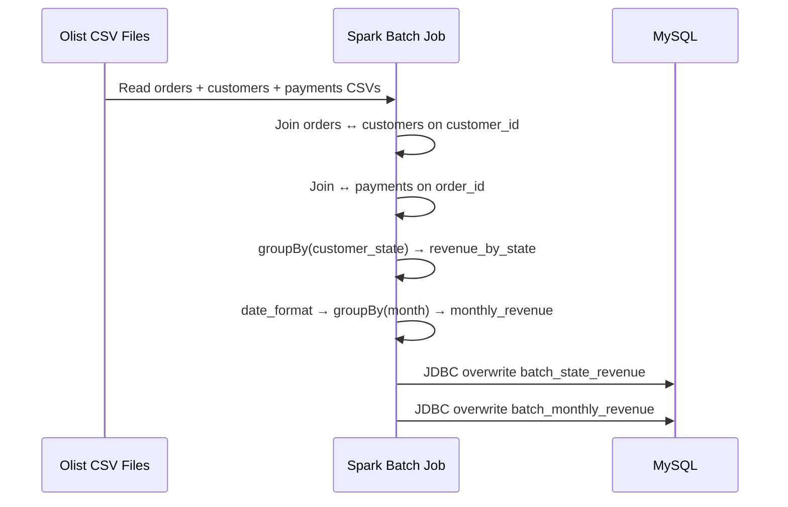

<h1 align="center">⚡ Real-Time E-Commerce Analytics Platform</h1>

<p align="center">
  A production-grade, real-time and batch analytics dashboard for e-commerce user behaviour —<br/>
  powered by <strong>Apache Spark Streaming</strong>, <strong>Apache Kafka</strong>, <strong>InfluxDB</strong>, <strong>Grafana</strong>, and a <strong>React + Chart.js</strong> custom dashboard.
</p>

<p align="center">
  
  
  
  
  
  
  
  
</p>

---

## 📋 Table of Contents

- [About the Project](#-about-the-project)
- [Architecture](#-architecture)
- [Tech Stack](#-tech-stack)
- [Project Structure](#-project-structure)
- [Data Pipeline](#-data-pipeline)
- [Spark Jobs](#-spark-jobs)
- [Dashboard](#-dashboard)
- [Dataset](#-dataset)
- [Installation & Setup](#-installation--setup)
- [Running the Project](#-running-the-project)
- [API Endpoints](#-api-endpoints)
- [Kafka Connectors](#-kafka-connectors)
- [Future Improvements](#-future-improvements)
- [Project Descriptions](#-project-descriptions)

---

## 🔍 About the Project

### Problem

E-commerce platforms generate millions of user events every second — clicks, purchases, campaign interactions. Traditional batch reporting tools can't keep pace, leaving business teams with stale, hours-old data. Businesses need insights **now**, not tomorrow morning.

### Solution

This platform combines **real-time stream processing** with **historical batch analytics** in a single unified dashboard:

- **Apache Kafka** ingests a continuous stream of user purchase events in **Avro format**
- **Apache Spark Structured Streaming** joins live Kafka events with **MySQL demographic data** (age, gender, country) in real time
- Aggregated results (purchase count, total revenue by country) are written back to MySQL every micro-batch
- A **React + Chart.js** custom dashboard auto-refreshes every **3 seconds** to show live KPIs and charts
- **Apache Spark Batch** processes the historical **Olist Brazilian E-commerce dataset** (CSV) to derive revenue by state and monthly revenue trends
- **Kafka Connect → InfluxDB → Grafana** provides a second time-series visualization layer for operational monitoring

### Key Insights Delivered

| Insight | Type | Source |
|---|---|---|
| Live revenue by country | Real-time | Spark Streaming → MySQL |
| Total revenue KPI | Real-time | Spark Streaming → MySQL |
| Total purchases KPI | Real-time | Spark Streaming → MySQL |
| Revenue by Brazilian state | Batch | Spark Batch → MySQL |
| Monthly revenue trend | Batch | Spark Batch → MySQL |
| Campaign performance | Streaming | Kafka → InfluxDB → Grafana |
| Gender / demographic breakdown | Streaming join | Spark + MySQL demographics |

---

## 🏗️ Architecture



---

## 🛠️ Tech Stack

| Layer | Technology | Version |
|---|---|---|
| **Stream Processing** | Apache Spark Structured Streaming | 3.0.1 |
| **Batch Processing** | Apache Spark SQL | 3.0.1 |
| **Message Broker** | Apache Kafka (Confluent) | 6.2.0 |
| **Schema Registry** | Confluent Schema Registry | 6.2.0 |
| **Serialization** | Apache Avro | 1.8.2 |
| **Stream-to-DB Sink** | Kafka Connect + InfluxDB Sink Connector | — |
| **Time-series DB** | InfluxDB | 1.x |
| **Visualization (ops)** | Grafana | — |
| **Operational DB** | MySQL | 8.0 |
| **Backend API** | Node.js + Express | — |
| **Frontend Dashboard** | React 19 + Vite + Chart.js | — |
| **Containerization** | Docker + Docker Compose | 3.8 |
| **Build Tool** | Maven | — |
| **Language (Spark)** | Java | 8 |
| **Dataset** | Olist Brazilian E-commerce (Kaggle) | — |

---

## 📂 Project Structure

```
Apache-Spark-E-commerce-website-/
│
└── realtime-analytics-Dashboard/
    │
    ├── README.md
    ├── Solution Methodology.pdf
    │
    ├── PDF files of Project tools/       # Reference documentation
    │   ├── Apache Kafka.pdf
    │   ├── Apache Spark.pdf
    │   ├── InfluxDb.pdf
    │   ├── High Level Design.pdf
    │   ├── Code Execution Flow.pdf
    │   ├── Dev Setup.pdf
    │   └── Overview.pdf
    │
    └── Codes Spark-Streaming/            # Main codebase
        │
        ├── docker-compose.yml            # Full infra: MySQL, Kafka, Zookeeper,
        │                                 #   Schema Registry, InfluxDB, Grafana
        ├── pom.xml                       # Maven: Spark, Kafka, Avro, MySQL deps
        ├── package.json                  # Root npm: concurrently runs both servers
        │
        ├── avro-console.json             # Kafka Connect → InfluxDB (products topic)
        ├── influx-consumer-activity-connector.json
        ├── influx-user-activity-demographic-connector.json
        │
        ├── olist-dataset/                # Kaggle Olist Brazilian E-commerce CSVs
        │   ├── olist_orders_dataset.csv
        │   ├── olist_customers_dataset.csv
        │   └── olist_order_payments_dataset.csv
        │
        ├── src/main/java/
        │   ├── jobs/
        │   │   ├── TopicDetails.java          # Kafka topic constants
        │   │   ├── UserActivity.java           # Kafka event producer model
        │   │   ├── UserDemoGraphicData.java    # Demographic data model
        │   │   │
        │   │   ├── stream/
        │   │   │   ├── SparkKafkaConsumerActivityNDemographic.java
        │   │   │   │     # Reads Kafka → joins MySQL demographics →
        │   │   │   │     # aggregates purchase_count + total_revenue by country →
        │   │   │   │     # writes to MySQL countryAgg (every micro-batch)
        │   │   │   │
        │   │   │   ├── SparkKafkaConsumerForConsumerIdCountry.java
        │   │   │   │     # Country-level consumer ID aggregation stream
        │   │   │   │
        │   │   │   └── UserActivityEventProducer.java
        │   │   │         # Java Kafka producer — publishes simulated user events
        │   │   │
        │   │   └── batch/
        │   │       ├── BatchOlistProcessor.java
        │   │       │     # Reads Olist CSV → joins orders + customers + payments →
        │   │       │     # writes revenue_by_state + monthly_revenue to MySQL
        │   │       │
        │   │       └── UserDemographicDataJob.java
        │   │             # Loads demographic seed data into MySQL
        │   │
        │   └── util/                     # Shared utilities
        │
        ├── analytics-dashboard-backend/  # Node.js REST API
        │   ├── server.js                 # Express server (port 5000)
        │   ├── db.js                     # MySQL connection
        │   └── routes/
        │       ├── batchRoutes.js        # /api/batch/state-revenue, /monthly-revenue
        │       ├── analytics.js
        │       └── realtimeRoutes.js
        │
        └── analytics-dashboard-frontend/ # React + Vite Dashboard
            ├── src/
            │   ├── App.jsx               # Main dashboard — Bar + Line charts,
            │   │                         #   KPI cards, 3s auto-refresh
            │   ├── App.css
            │   └── main.jsx
            └── vite.config.js
```

---

## 🔄 Data Pipeline

### Real-time Pipeline



### Batch Pipeline



---

## ⚡ Spark Jobs

### `SparkKafkaConsumerActivityNDemographic.java`
**Type:** Spark Structured Streaming

| Step | Action |
|---|---|
| **1. Read** | Kafka topic `consumer_activity` (JSON format, from `earliest`) |
| **2. Parse** | Extract schema: `id, campaignid, orderid, total_amount, units, activity` |
| **3. Join** | Stream-static JOIN with MySQL `userdemographics` table on user ID |
| **4. Filter** | Keep only `activity = 'purchase'` events |
| **5. Aggregate** | `groupBy(country)` → `count(*) as purchase_count`, `sum(total_amount) as total_revenue` |
| **6. Sink** | `foreachBatch` → JDBC overwrite to MySQL `countryAgg` table |
| **Output mode** | `complete` (full re-aggregation every micro-batch) |

---

### `SparkKafkaConsumerForConsumerIdCountry.java`
**Type:** Spark Structured Streaming

Consumes Kafka events and aggregates at the consumer ID + country level for granular tracking of user behaviour across geographies.

---

### `BatchOlistProcessor.java`
**Type:** Spark Batch (one-shot)

| Step | Action |
|---|---|
| **1. Load** | Read `olist_orders_dataset.csv`, `olist_customers_dataset.csv`, `olist_order_payments_dataset.csv` |
| **2. Join** | orders ↔ customers on `customer_id` |
| **3. Join** | ↔ payments on `order_id` |
| **4. Revenue by State** | `groupBy(customer_state)` → `sum(payment_value)` → write `batch_state_revenue` |
| **5. Monthly Revenue** | `date_format(order_purchase_timestamp, "yyyy-MM")` → `groupBy(month)` → `sum(payment_value)` → write `batch_monthly_revenue` |

---

### `UserDemographicDataJob.java`
**Type:** Spark Batch (seed job)

Loads user demographic seed data (age, gender, country) into the MySQL `userdemographics` table — used by the streaming join.

---

### `UserActivityEventProducer.java`
**Type:** Kafka Producer (Java)

Simulates live e-commerce user events (purchases, clicks, campaign interactions) and publishes them to the Kafka `consumer_activity` topic in real time.

---

## 📊 Dashboard

The React dashboard (Vite + Chart.js) connects to the Node.js API and auto-refreshes every **3 seconds**:

| Panel | Chart Type | Data Source |
|---|---|---|
| **Total Revenue KPI** | Stat card | `/api/kpi` → MySQL `countryAgg` |
| **Total Purchases KPI** | Stat card | `/api/kpi` → MySQL `countryAgg` |
| **Live Revenue by Country** | Bar chart | `/api/country-agg` → MySQL `countryAgg` |
| **Revenue by State (Historical)** | Bar chart | `/api/batch/state-revenue` → MySQL `batch_state_revenue` |
| **Monthly Revenue Trend** | Line chart | `/api/batch/monthly-revenue` → MySQL `batch_monthly_revenue` |

**Grafana** provides a second layer of dashboards connected to InfluxDB for:
- Campaign performance over time
- Gender-based purchase breakdown
- Country-level purchase trends (time-series)

---

## 📁 Dataset

### Olist Brazilian E-Commerce (Batch)
- **Source:** [Kaggle — Brazilian E-Commerce Public Dataset by Olist](https://www.kaggle.com/datasets/olistbr/brazilian-ecommerce)
- **Files used:** `olist_orders_dataset.csv`, `olist_customers_dataset.csv`, `olist_order_payments_dataset.csv`
- **Size:** ~100K orders across Brazilian states
- **Used for:** State-level revenue and monthly trend batch analytics

### Simulated User Activity Events (Streaming)
- **Generated by:** `UserActivityEventProducer.java`
- **Schema:** `id, campaignid, orderid, total_amount, units, activity`
- **Topics:** `consumer_activity`, `products`
- **Format:** JSON (via Kafka) / Avro (via Schema Registry for InfluxDB sink)

---

## 🚀 Installation & Setup

### Prerequisites

| Tool | Version | Purpose |
|---|---|---|
| Docker Desktop | Latest | Run all infra services |
| Java JDK | 8 | Compile and run Spark jobs |
| Apache Spark | 3.0.1 | Spark runtime (local mode) |
| Maven | 3.x | Build Java project |
| Node.js | 18+ | Backend API + frontend |
| npm | 9+ | Package management |

---

### Step 1 — Start Infrastructure (Docker)

```bash
cd "realtime-analytics-Dashboard/Codes Spark-Streaming"
docker-compose up -d
```

This starts:

| Container | Port | Service |
|---|---|---|
| `mysql` | `3306` | MySQL 8.0 |
| `zookeeper` | `2181` | Kafka Zookeeper |
| `broker` | `9092`, `29092` | Kafka Broker |
| `schema-registry` | `8081` | Confluent Schema Registry |
| `influx_grafana` | `3003` (Grafana), `8086` (InfluxDB) | InfluxDB + Grafana |

Verify all containers are healthy:
```bash
docker ps
```

---

### Step 2 — Create Kafka Topics

```bash
# Create consumer_activity topic
docker exec broker kafka-topics --create \
  --bootstrap-server localhost:9092 \
  --replication-factor 1 \
  --partitions 1 \
  --topic consumer_activity

# Create products topic
docker exec broker kafka-topics --create \
  --bootstrap-server localhost:9092 \
  --replication-factor 1 \
  --partitions 1 \
  --topic products
```

---

### Step 3 — Set Up MySQL Schema

Connect to MySQL and create the required tables:

```sql
CREATE DATABASE IF NOT EXISTS users;
USE users;

-- Demographic seed data
CREATE TABLE userdemographics (
  i INT PRIMARY KEY,
  country VARCHAR(100),
  age INT,
  gender VARCHAR(10)
);

-- Real-time aggregation result
CREATE TABLE countryAgg (
  country VARCHAR(100),
  purchase_count BIGINT,
  total_revenue BIGINT
);

-- Batch results
CREATE TABLE batch_state_revenue (
  customer_state VARCHAR(10),
  total_revenue DOUBLE
);

CREATE TABLE batch_monthly_revenue (
  month VARCHAR(10),
  total_revenue DOUBLE
);
```

---

### Step 4 — Build the Spark Project

```bash
cd "realtime-analytics-Dashboard/Codes Spark-Streaming"
mvn clean package -DskipTests
```

---

### Step 5 — Register Kafka Connect Connectors

```bash
# Register InfluxDB Sink Connector for products topic
curl -X POST http://localhost:8083/connectors \
  -H "Content-Type: application/json" \
  -d @avro-console.json

# Register connector for user activity demographic
curl -X POST http://localhost:8083/connectors \
  -H "Content-Type: application/json" \
  -d @influx-user-activity-demographic-connector.json
```

---

### Step 6 — Install Node.js Dependencies

```bash
cd "realtime-analytics-Dashboard/Codes Spark-Streaming"
npm install

cd analytics-dashboard-backend && npm install && cd ..
cd analytics-dashboard-frontend && npm install && cd ..
```

---

## ▶️ Running the Project

### 1 — Seed Demographic Data (one-time)

```bash
spark-submit --class jobs.batch.UserDemographicDataJob \
  target/spark-streaming_2.12-0.1.jar
```

### 2 — Run Batch Processing (Olist dataset)

```bash
spark-submit --class jobs.batch.BatchOlistProcessor \
  target/spark-streaming_2.12-0.1.jar
```

### 3 — Start the Event Producer

```bash
spark-submit --class jobs.stream.UserActivityEventProducer \
  target/spark-streaming_2.12-0.1.jar
```

### 4 — Start Spark Streaming Jobs

```bash
# Job 1: Activity + Demographic join → countryAgg
spark-submit --class jobs.stream.SparkKafkaConsumerActivityNDemographic \
  target/spark-streaming_2.12-0.1.jar

# Job 2: Consumer ID + Country aggregation
spark-submit --class jobs.stream.SparkKafkaConsumerForConsumerIdCountry \
  target/spark-streaming_2.12-0.1.jar
```

### 5 — Start the Dashboard

```bash
# Starts backend (port 5000) + frontend (port 5173) concurrently
npm start
```

Open: **http://localhost:5173**

---

## 📡 API Endpoints

| Method | Endpoint | Description | Response |
|---|---|---|---|
| `GET` | `/api/country-agg` | Real-time purchase count + revenue by country | `[{ country, purchase_count, total_revenue }]` |
| `GET` | `/api/kpi` | Aggregated total revenue + total purchases | `{ revenue, purchases }` |
| `GET` | `/api/batch/state-revenue` | Historical revenue by Brazilian state | `[{ customer_state, total_revenue }]` |
| `GET` | `/api/batch/monthly-revenue` | Historical monthly revenue trend | `[{ month, total_revenue }]` |

---

## 🔌 Kafka Connectors

### `avro-console.json` — InfluxDB Sink (products topic)

```json
{
  "connector.class": "io.confluent.influxdb.InfluxDBSinkConnector",
  "topics": "products",
  "influxdb.url": "http://influx-grafana:8086",
  "influxdb.db": "influxTestDB",
  "value.converter": "io.confluent.connect.avro.AvroConverter"
}
```

### `influx-user-activity-demographic-connector.json` — InfluxDB Sink (user activity)

Pushes enriched user activity + demographic events from Kafka to InfluxDB for Grafana time-series dashboarding.

---

## 🔭 Future Improvements

| Improvement | Description |
|---|---|
| ☁️ **Cloud Deployment** | Deploy on AWS EMR (Spark), MSK (Kafka), RDS (MySQL), and S3 for dataset storage |
| 📊 **Grafana Unification** | Replace custom React dashboard with full Grafana dashboard using MySQL + InfluxDB sources |
| 🧠 **ML Integration** | Add Spark MLlib model for real-time purchase propensity scoring |
| 🔁 **Kafka Streams** | Replace some Spark streaming jobs with lightweight Kafka Streams for sub-second latency |
| 🐳 **Full Containerization** | Dockerize Spark jobs and Node.js API into the same compose network |
| 🔐 **Schema Evolution** | Leverage Schema Registry for backward-compatible Avro schema upgrades |
| 📈 **More KPIs** | Add average order value, cart abandonment rate, top products by revenue |
| 🌍 **Geo-visualization** | Use Leaflet.js or Kepler.gl for country/state revenue map visualization |
| ⚙️ **CI/CD Pipeline** | Add GitHub Actions for automated Maven build and container deployments |

---

## 💼 Project Descriptions

### GitHub Repository Description
> Real-time e-commerce analytics platform using Apache Spark Structured Streaming, Apache Kafka, InfluxDB, Grafana, MySQL, and React. Streams user purchase events → joins with demographic data → aggregates KPIs live. Also processes historical Olist Brazilian E-commerce CSV data with Spark Batch for state and monthly revenue trends.

### LinkedIn / Portfolio
> Built a full real-time + batch e-commerce analytics platform from scratch. Apache Spark Structured Streaming consumes Kafka purchase events, performs a stream-static JOIN with MySQL demographic data, and aggregates revenue KPIs by country — writing results to MySQL every micro-batch. A React + Chart.js dashboard auto-refreshes every 3 seconds to show live revenue, purchase counts, and trend charts. Spark Batch additionally processes the Olist Brazilian E-commerce dataset (100K+ orders) for historical revenue analysis by state and month. Full infrastructure managed with Docker Compose (Kafka, Zookeeper, Schema Registry, InfluxDB, Grafana, MySQL).

### Resume Bullet Points
```
• Built a real-time e-commerce analytics pipeline using Apache Spark Structured Streaming 3.0.1
  and Apache Kafka — processing user purchase events with sub-second latency

• Implemented stream-static JOIN in Spark between live Kafka event stream and MySQL
  demographic table, aggregating purchase_count and total_revenue by country per micro-batch

• Processed the Olist Brazilian E-Commerce dataset (100K+ orders) using Apache Spark Batch,
  computing revenue by state and monthly revenue trends via multi-dataset CSV joins

• Designed a Kafka Connect → InfluxDB → Grafana pipeline for time-series operational
  monitoring of campaign performance and demographic purchase breakdowns

• Built a React 19 + Vite + Chart.js dashboard with 3-second auto-refresh showing live KPI
  cards and bar/line charts, backed by a Node.js + Express + MySQL REST API

• Containerized the full infrastructure stack (MySQL, Kafka, Zookeeper, Schema Registry,
  InfluxDB, Grafana) using Docker Compose
```

---

## 📄 Documentation

The `PDF files of Project tools/` folder contains detailed reference documentation:

| File | Contents |
|---|---|
| `Overview.pdf` | Project overview and use case |
| `High Level Design.pdf` | Architecture design decisions |
| `Code Execution Flow.pdf` | Step-by-step execution guide |
| `Dev Setup.pdf` | Full developer environment setup |
| `Apache Spark.pdf` | Spark concepts and configuration |
| `Apache Kafka.pdf` | Kafka concepts and configuration |
| `InfluxDb.pdf` | InfluxDB setup and querying |

---

<p align="center">
  Built with ⚡ Apache Spark · 📨 Apache Kafka · ⚛️ React · 🗄️ MySQL · 📊 Grafana · 🐳 Docker
  <br/><br/>
  <a href="https://github.com/shubham1852/Apache-Spark-E-commerce-website-">⭐ Star this repo</a> &nbsp;•&nbsp;
  <a href="https://github.com/shubham1852/Apache-Spark-E-commerce-website-/issues">🐛 Report an Issue</a>
</p>
